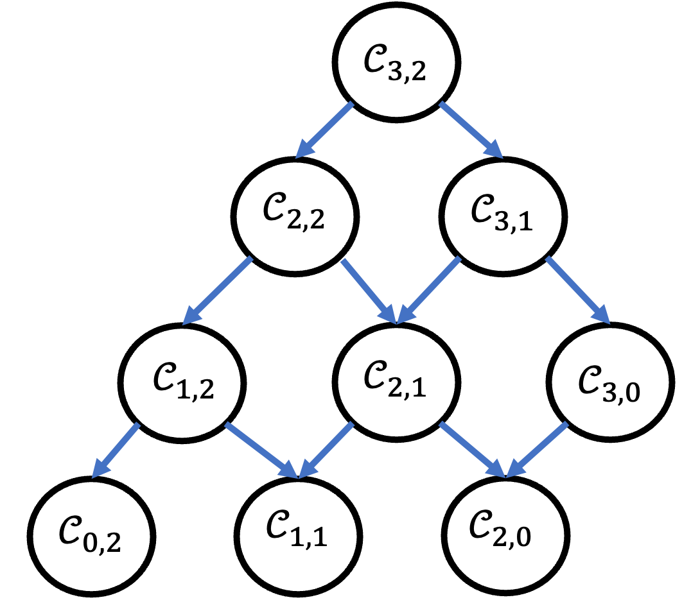

# QuantumGraining


## Introduction
**QuantumGraining.jl** offers a practical, generalized approach to the time-coarse graining (TCG) method in quantum optics. Often in quantum optics, we are not interested in the short time-scale dynamics -- these are either trivial, or unmeasurable, and keeping track of them is very computationally expensive. The time-coarse graning approach gives an effective, low-frequency description of the time-coarse grained dynamics, without neglecting the effects the high-frequency modes have on this dynamics.

One can think of the time-coarse graining method as a generalization of the rotating-wave approximation, where the time-averaging is performed at the propagator level rather than the Hamiltonian level. More technically, while the rotating-wave approximation neglects all contributions due to counter-propagating terms, the time-coarse graining method is able to include `k`-order terms that can be comprised off these counter-rotating terms,
up to some arbitrary order `k`.  A familiar example would be virtual processes such as the simultaneous emission of a photon together with the excitation of an atom, followed the immediate absorption and de-excitation of the system.

Moreover, the TCG method provides this description in terms of a generalized Linbdladian -- a Hamiltonian and a list of "dissipators" -- that fully generate these processes up to the desired order of approximation. In addition to the obvious benefits of a low-frequency description, this allows one to understand the effects of high-frequency modes directly as emergent dynamics on the relevant modes of interest.

The TCG method is very computationally involved, with the number of terms growing rapidly with the order of truncation. The main object of interest is the "contraction coefficient" which encapsulates the relative weight of each possible `k`-order process. Each of these coefficients requires the recursive calculation of lower-order contraction coefficients to compute, a process which is the repeated for each frequency mode in the original Hamiltonian.



## QuantumGraining.jl
**QuantumGraining.jl** automates the TCG process, symbolically calculating the effective Lindbladians in terms of abstract operators that are easily integrated into other symbolic packages, such as **QuantumCumulants.jl** and **QuantumOptics.jl**.

* The model (Hamiltonian) is specified, along with the time-coarse graining time-scale.
* The effective Lindbladian is calculated, using an efficient, recursive approach. The resulting Lindbladian is stored stored as a symbolic expression using the [**Symbolics.jl**](https://github.com/JuliaSymbolics/Symbolics.jl) framework, which is also used for any additional simplification and rewriting.
* Finally, the symbolic Hamiltonian can be solved in **QuantumOptics.jl** or using **QuantumCumulants.jl**. 

## Installation

`QuantumGraining.jl` is in early stages of developemnt, and is still not registered in the Julia package registrator. For the time being, the package can be installed by cloning the repository from GitHub. 
To install, clone the repository, then use the Julia package manager to `activate` and `build`.

## Development Status
Note that **QuantumGraining.jl** is still at an early stage of development.

[](https://github.com/leonbello/QuantumGraining.jl/actions/workflows/CI.yml?query=branch%3Amain)

## Short example
As a simple illustrative example, let us consider the implementation of a second-order time coarse graining of the Rabi model:
```
using QuantumCumulants
using QuantumGraining

ha = NLevelSpace(Symbol(:atom));     hc = FockSpace(:cavity);  
h = hc ⊗ hc                                                     # Atom and Field spaces

σ(i,j) = Transition(ha, Symbol("σ_{$k}"), i, j)    
σz = 2*σ(1,1) - 1
σx = σ(1,2) + σ(2,1)                                            # Spin operators

@cnumbers ω_c ω_a Ω

ωs = [ω_c+ω_a, -ω_c-ω_a, -ω_c+ω_a, ω_c-ω_a]
hs = Ω/2 .* [a*σ(2,1), a'*σ(1,2), a*σ(1,2), a'*σ(2,1)]

H, L_list, J_list = effective_lindblad(h_list, ω_list, order=2)
```

The code above returns an effective Lindbladian that generates the time-coarse grained evolution of the Rabi-model up to second-order. The input is a list of frequencies and their corresponding operators, and the output is a symbolic description of the dynamics in the form of a new effective Hamiltonian, and new generalized dissipators.